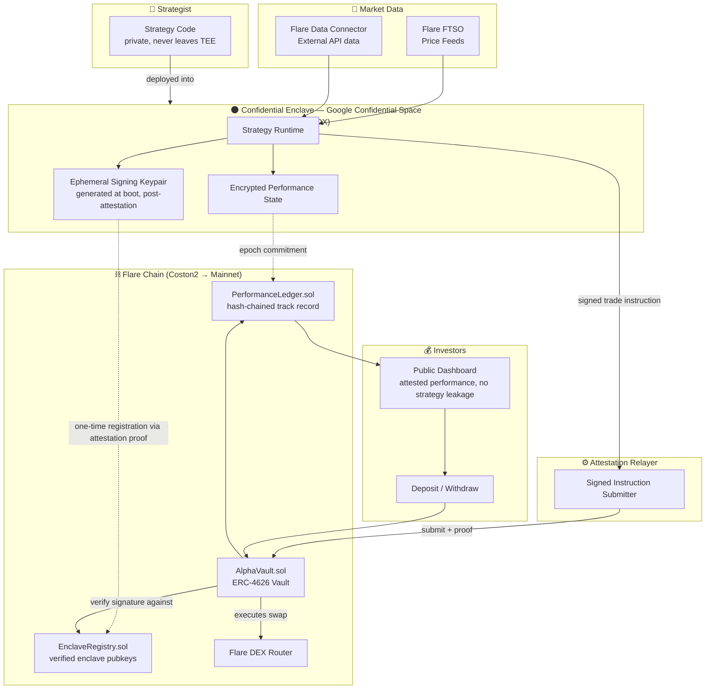
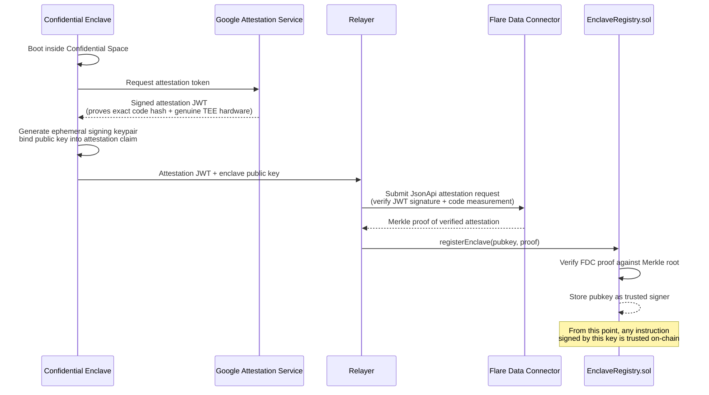
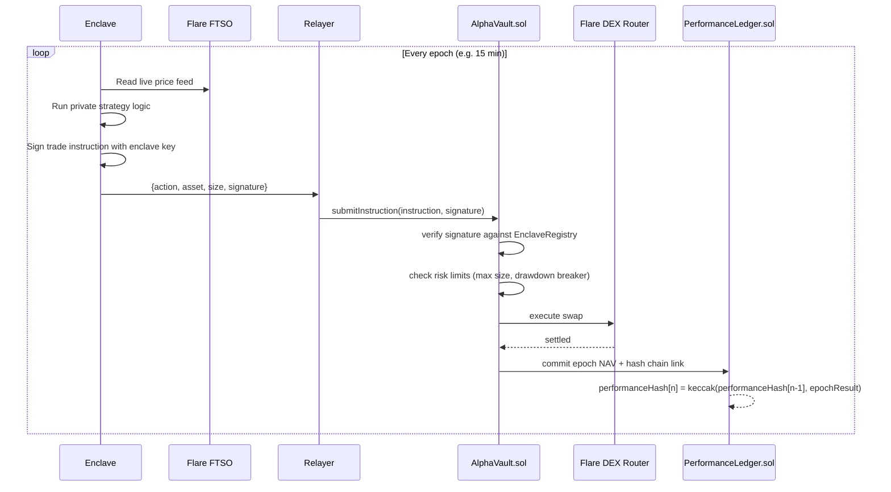
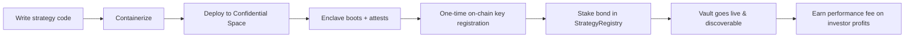
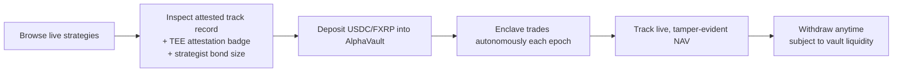

# Eclipse-Protocol

# 🌑 Eclipse Protocol

### Verifiable Alpha. Invisible Strategy.

**A confidential-compute asset management protocol on Flare — where trading strategies stay hidden inside a TEE, but every trade and every dollar of performance is cryptographically verifiable on-chain.**

Built for **Flare Summer Signal Hackathon — Bounty 2: Confidential Compute Apps**

---

## Table of Contents

- [Why "Eclipse"](#why-eclipse)
- [The Problem](#the-problem)
- [The Solution](#the-solution)
- [Why This Needs a TEE (Not Just a Smart Contract)](#why-this-needs-a-tee-not-just-a-smart-contract)
- [Architecture](#architecture)
- [Trust Model](#trust-model)
- [User Flows](#user-flows)
- [Tech Stack](#tech-stack)
- [Flare Bounty Alignment](#flare-bounty-alignment)
- [What's Newly Built for This Hackathon](#whats-newly-built-for-this-hackathon)
- [MVP Scope (Aug 14 Deadline)](#mvp-scope-aug-14-deadline)
- [Demo Pitch (60 Seconds)](#demo-pitch-60-seconds)
- [Roadmap Beyond the Hackathon](#roadmap-beyond-the-hackathon)
- [Repository Structure](#repository-structure)

---

## Why "Eclipse"

An eclipse hides the light source but the effect it casts — the shadow, the corona, the measurable event — is undeniable and observable by anyone on Earth.

That's the whole protocol in one image: **the strategy (the light source) is hidden inside the enclave. The alpha it generates (the signal) is fully public, attested, and verifiable.** Nobody has to trust the trader's word — they can verify the eclipse happened, down to the second, without ever seeing the sun.

---

## The Problem

Two groups in crypto trading have been talking past each other for years:

**Quant traders and strategists** have real, profitable edge — but won't share the logic, signals, or model weights that generate it. The moment a strategy is published or copy-traded in the open, it gets front-run, reverse-engineered, or arbitraged away within days. So the best strategies stay private, off-chain, and largely inaccessible to outside capital.

**Investors and allocators** want access to that edge, but every on-chain "copy trading" or "signal" platform today asks for blind trust: *"deposit your money, trust our black box."* There is no way to verify that a strategy's historical track record is real, that trades weren't cherry-picked after the fact, or that the same signals aren't being front-run by the platform operator itself.

The result is a structural standoff: **real alpha stays private and inaccessible to capital; accessible strategies are rarely the real alpha.** Existing platforms (copy-trading apps, structured-alpha marketplaces, on-chain "vaults" with opaque strategists) solve this by asking one side to give something up — either the strategist exposes their edge, or the investor gives up verifiability. Nobody has solved both sides at once.

---

## The Solution

Eclipse Protocol lets a strategist deploy their trading logic **entirely inside a hardware-attested Trusted Execution Environment**. The enclave:

- Ingests market data and strategy state
- Runs the proprietary logic — signals, model, indicators, whatever it is — in complete isolation
- Emits **only** a signed trade instruction (direction, size, asset pair) — never the logic that produced it
- Maintains a running, tamper-evident performance ledger

Every trade instruction is cryptographically signed by a key that only exists inside an attested enclave. Flare smart contracts verify that signature before executing anything, and an on-chain performance ledger accumulates a permanent, auditable track record — hash-chained so it cannot be edited retroactively.

**Investors get a Numerai-style guarantee**: they can mathematically verify the strategy ran inside genuine, unmodified, isolated hardware, and that the performance history is real and untampered — without the strategist ever revealing a single line of code or a single signal.

**Strategists get what they've never had on-chain**: access to permissionless capital without giving up their edge.

---

## Why This Needs a TEE (Not Just a Smart Contract)

This is the question every Bounty 2 judge will ask, so it's worth answering directly:

| Requirement | Why a smart contract alone can't do it | What the TEE provides |
|---|---|---|
| Strategy logic must stay private | All EVM state and calldata is public | Enclave memory is encrypted and isolated from the host, hypervisor, and even Flare validators |
| Strategy must still act autonomously on live market data | On-chain compute is expensive and public; strategies would leak via gas traces / calldata | Enclave runs off-chain compute at full speed, privately, then emits only the final decision |
| Investors need to trust the output without trusting the operator | A centralized backend claiming "trust me" is exactly the failure mode we're replacing | Remote attestation cryptographically proves the exact code that ran, before any output is trusted |
| Track record must be provably untampered | A database can be edited after the fact | Enclave-signed, hash-chained performance ledger — any retroactive edit breaks the chain and is publicly detectable |

The privacy need (protect proprietary strategy IP) and the verifiability need (prove correct, tamper-free execution) are in direct tension — a TEE is the only primitive that resolves both simultaneously.

---

## Architecture

### System Overview



### Trust Bootstrap — One-Time Enclave Attestation



### Live Trading Loop



---

## Trust Model

It's important to be explicit about what is and isn't trusted, because this is a core judging criterion.

**Trusted:**
- Google Confidential Space's hardware attestation (AMD SEV-SNP / Intel TDX) — the same primitive used by Flare's own `flare-ai-kit` SDK
- Flare's FDC consensus (50%+ signature weight) for bringing the attestation proof on-chain
- Standard EVM contract security assumptions on Flare

**Not trusted / explicitly out of scope for MVP:**
- The relayer is not trusted with funds — it only forwards signed messages; a malicious relayer cannot forge instructions because it doesn't hold the enclave's signing key, and the vault contract independently verifies signatures
- Side-channel attacks against the TEE hardware itself are a known, disclosed limitation of any TEE-based system (industry-wide, not specific to this protocol) — mitigations (network hardening, no interactive login, disk encryption) follow the same pattern used in NVIDIA FLARE and Google Confidential Space production deployments
- Strategist bonding/staking (in `StrategyRegistry.sol`) provides an economic backstop: strategists post collateral that's slashed on detected malicious behavior (e.g. registering a new unattested key), so investors aren't purely relying on hardware trust alone

---

## User Flows

### Strategist Flow



### Investor Flow



---

## Tech Stack

| Layer | Technology |
|---|---|
| Confidential compute | Google Cloud Confidential Space (AMD SEV-SNP / Intel TDX), attestation via RA-TLS pattern |
| Enclave runtime | Node.js / TypeScript strategy runner, containerized (Docker) |
| Smart contracts | Solidity, Foundry — `EnclaveRegistry.sol`, `AlphaVault.sol` (ERC-4626), `PerformanceLedger.sol`, `StrategyRegistry.sol` |
| Oracle / attestation bridging | Flare Data Connector (FDC) JsonApi attestation type, Flare FTSO price feeds |
| Execution venue | Flare-native DEX router (e.g. SparkDEX) for swap execution |
| Relayer service | Node.js/TypeScript, ethers.js/viem |
| Frontend | Next.js, TypeScript, wagmi/viem, Tailwind |
| Network | Coston2 testnet → Flare mainnet |

---

## Flare Bounty Alignment

| Judging Criterion | How Eclipse Protocol Delivers |
|---|---|
| **Product usefulness** | Solves a real, named market failure — strategists won't share IP, investors won't trust black boxes — with a working vault, not a toy demo |
| **Flare integration quality** | Enclave attestation is anchored on-chain via FDC consensus; trade execution and performance data live entirely on Flare contracts; FTSO feeds strategy inputs |
| **Technical execution** | Full-stack working demo: real enclave, real attested signing key, real on-chain vault executing real swaps on testnet, verifiable end-to-end |
| **Evidence of new work** | Entire protocol — enclave runtime, contracts, relayer, frontend — built from zero during the hackathon window |
| **Clarity & future potential** | Clear path beyond hackathon: strategy marketplace, multi-chain execution (Solana vaults), institutional onboarding, audited mainnet |

---

## What's Newly Built for This Hackathon

This is a brand-new protocol, not a port of an existing product — everything below is built during the hackathon window:

- `EnclaveRegistry.sol` — on-chain enclave attestation verification & key registration
- `AlphaVault.sol` — ERC-4626 vault with signature-gated trade execution and risk limits
- `PerformanceLedger.sol` — hash-chained, tamper-evident performance tracking
- `StrategyRegistry.sol` — strategist bonding, fee split, strategy discovery
- Confidential Space enclave runtime + attestation bootstrap flow
- Relayer service bridging enclave output to Flare via FDC
- Investor + strategist frontend dashboards

---

## MVP Scope (Aug 14 Deadline)

**Week 1** — Contracts: `EnclaveRegistry`, `AlphaVault` (deposit/withdraw/instruction verification), Foundry test suite, deploy to Coston2.

**Week 2** — Enclave: containerized strategy runner (one real, simple momentum/mean-reversion strategy on a live Flare-listed pair), attestation bootstrap, ephemeral key signing.

**Week 3** — Relayer + FDC integration (enclave attestation → on-chain registration), `PerformanceLedger` wiring, DEX router execution, end-to-end testnet run generating a real, live, attested track record during the demo window.

**Week 4** — Frontend (investor dashboard with attestation badge + live NAV chart, strategist dashboard), polish, demo video, submission writeup.

---

## Demo Pitch (60 Seconds)

> "Right now, the best trading strategies in crypto never touch on-chain capital, because the moment you publish a signal, it's dead — copied or front-run within hours. Eclipse Protocol solves that by running the strategy entirely inside a hardware-attested confidential enclave. The strategist's code never leaves the TEE — not to us, not to investors, not even to Flare validators. What comes out is a single signed trade instruction, verified on-chain against a registered enclave key, executed by a real vault, and recorded into a tamper-evident performance ledger.
>
> On screen right now, you're watching a real strategy trade live inside a Confidential Space enclave on Google Cloud, its trades landing on Flare Coston2 in real time, building a verifiable track record — and you still can't see a single line of its logic. That's the whole point: verifiable alpha, invisible strategy. This isn't a toy — it's the first primitive that lets real trading IP access permissionless on-chain capital without giving up its edge."

---

## Roadmap Beyond the Hackathon

- **Post-hackathon:** Security audit of vault + registry contracts, mainnet deployment
- **Q4 2026:** Strategy marketplace — multiple concurrent strategist vaults, investor-facing strategy discovery and comparison
- **2027:** Multi-chain execution vaults (Solana/Anchor execution alongside Flare EVM vaults), leveraging native Flare Confidential Compute (PMWs) once mainnet-live to reduce reliance on Google Confidential Space
- **Longer term:** Institutional-grade onboarding (compliance-gated vaults), performance-fee tooling, strategist reputation scoring built on the attested track record history

---

## Repository Structure

```
eclipse-protocol/
├── contracts/
│   ├── src/
│   │   ├── EnclaveRegistry.sol
│   │   ├── AlphaVault.sol
│   │   ├── PerformanceLedger.sol
│   │   └── StrategyRegistry.sol
│   ├── test/
│   └── script/
├── enclave/
│   ├── src/           # strategy runtime (TypeScript)
│   ├── attestation/   # RA-TLS bootstrap logic
│   └── Dockerfile
├── relayer/
│   └── src/
├── frontend/
│   ├── app/
│   └── components/
└── README.md
```

---

*Built for Flare Summer Signal — Bounty 2: Confidential Compute Apps*
