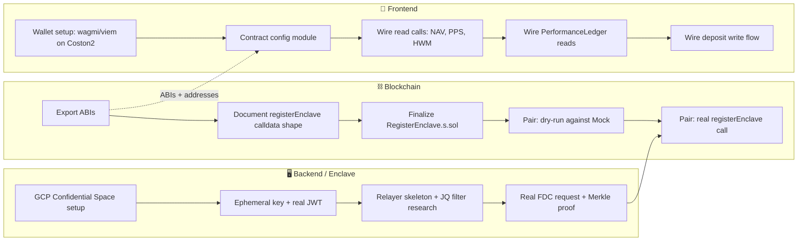

# 🌑 Eclipse Protocol — Week 1 Sprint Plan

**Sprint window:** Jul 7 – Jul 13
**Sprint goal:** De-risk the single scariest unknown in the whole protocol — the real TEE attestation → FDC → on-chain registration pipeline — while frontend and contracts move from mocks to real, live data in parallel.

**Team assumed:** 3 devs — **Blockchain/Contracts**, **Backend (Enclave + Relayer)**, **Frontend**. If you're 2 devs, merge Blockchain into Backend's track (they're lighter this week anyway) and keep Frontend separate.

---

## Already Done (starting point for this sprint)

All 4 core contracts are deployed and verified on **Coston2** — nobody should be redeploying these this week unless a real integration bug is found:

| Contract | Address |
|---|---|
| `PerformanceLedger` | `0x7872610DF425FC201815AeeEf9Cb58B554e63259` |
| `EnclaveRegistry` | `0x2aB29978069dd277B11da118D8fEb160c281A8Ac` |
| `StrategyRegistry` | `0xA83967EB088806724B2a8baa484BafE02e68Adfd` |
| `AlphaVault` | `0x1b0cf88974ffBC1Fb1744831db5657331627aEcd` |

*(Double-check these addresses against your own deployment logs before distributing them — copy-paste errors in 40-character hex strings are the easiest bug to introduce and the hardest to spot by eye.)*

---

## Cross-Team Dependency Map (read this first)

**The one hard blocking dependency this week:** Frontend's contract config (Day 2) needs ABIs from Blockchain (Day 1). Everything else can run in parallel. The Backend track is almost entirely independent until the Day 4–5 pairing session — don't let Blockchain or Frontend wait around for FDC's 3–5 minute round times; that's Backend's problem to absorb, not the team's.

---

## Blockchain / Contracts Track

*(Lighter week — contracts are built; this is support, documentation, and one high-stakes pairing session.)*

**Day 1**
- [ ] Run `forge build` and export ABI JSON for all 4 contracts to a shared location (e.g. `frontend/src/abi/` or a small internal package) so Frontend isn't blocked
- [ ] Confirm all 4 contracts are verified on Coston2 Blockscout (`https://coston2-explorer.flare.network`) — verify any that aren't yet
- [ ] Share the deployed addresses table above + ABIs with Frontend and Backend

**Day 2**
- [ ] Document the exact expected calldata shape for `EnclaveRegistry.registerEnclave(vault, signer, proof)` — the precise types and encoding Backend's relayer must produce, since a mismatch here is the easiest way to burn a 3–5 minute FDC round on a doomed call
- [ ] Confirm the live `IFdcVerification` function signature on Coston2 matches what's implemented in the contracts — check against Flare's current periphery package rather than assuming it hasn't changed

**Day 3**
- [ ] Finalize `script/RegisterEnclave.s.sol` end-to-end, parameterized via env vars (`ENCLAVE_SIGNER_ADDRESS`, `FDC_ATTESTATION_PROOF`), ready to fire the moment Backend has a real proof in hand
- [ ] Write a short internal note on exactly how to run it (command, required env vars) so whoever's at the keyboard during the Day 4–5 pairing session isn't fumbling

**Day 4**
- [ ] **Pair with Backend:** dry-run a `registerEnclave()` call against `MockFdcVerification` using a realistically-shaped (fake but well-formed) proof payload — the goal is to catch ABI-encoding mismatches *before* spending a real FDC round on a live attempt

**Day 5**
- [ ] **Pair with Backend:** attempt the real `registerEnclave()` call on Coston2 using Backend's genuine FDC-verified proof. Debug together if it fails — this is the sprint's single most important moment, worth protecting the whole day for
- [ ] Stretch, only if Day 5 finishes early: start scoping dynamic `FlareContractRegistry` address resolution (`0xaD67FE66660Fb8dFE9d6b1b4240d8650e30F6019`) — not required this week, don't let it eat into the pairing session

---

## Backend / Enclave + Relayer Track

*(Critical path — this is the riskiest, least-proven part of the whole protocol. Everything else this week is scoped to not block on it, but it's the thing that determines whether Week 2 is realistic.)*

**Day 1**
- [ ] Set up the GCP project, enable Confidential Space, provision a service account with the minimum required IAM permissions
- [ ] Scaffold a minimal Node/TypeScript container — no strategy logic yet, just something that boots inside Confidential Space and can run code

**Day 2**
- [ ] Implement ephemeral secp256k1/ECDSA keypair generation inside the container
- [ ] Implement the OIDC attestation token request to Google's Attestation Service, binding the signer's public key hash into the nonce claim — reference Flare's own `flare-ai-kit` (`vtpm_attestation.py`) as the proven pattern rather than building this from scratch
- [ ] **Milestone: get one real, valid attestation JWT out of a genuine Confidential Space VM.** This alone is worth celebrating — it's the first real (non-mocked) artifact in the whole pipeline

**Day 3**
- [ ] Stand up a minimal relayer service (Node/TS) that can expose the JWT at a fetchable URL and submit an FDC `JsonApi` (`Web2Json`) attestation request on Coston2
- [ ] Research and draft the exact `postProcessJq` filter needed to extract `(address vault, address enclaveSigner)` from the real JWT's claims — this is explicitly the piece flagged as missing in the integration spec, and the one most likely to need several iterations
- [ ] Get the real JWT's claim structure fully documented (dump and inspect it) before writing the filter blind

**Day 4**
- [ ] Submit the real FDC attestation request using the drafted JQ filter
- [ ] Budget for the ~90-second collection phase plus voting/consensus — expect this round-trip to take 3–5 minutes per attempt, so plan for maybe 2–4 real attempts today, not dozens
- [ ] Once a Merkle proof comes back, verify it actually decodes to the correct `(vault, signer)` tuple *before* involving Blockchain — don't burn the pairing session debugging a proof you could have validated solo

**Day 5**
- [ ] **Pair with Blockchain:** feed the genuine, validated FDC proof into `RegisterEnclave.s.sol` and attempt the real on-chain call
- [ ] Whatever happens (success or failure), write down the exact working (or currently-blocking) JQ filter and proof structure — this closes out the "Missing JQ Filter Spec" gap from the audit doc and saves the next person from re-deriving it

---

## Frontend Track

*(Almost entirely unblocked this week — contracts are already deployed. Priority: replace mock data with real reads, wallet-first.)*

**Day 1**
- [ ] Integrate `wagmi` + `viem` (+ RainbowKit or ConnectKit — your call) configured for Coston2 (chain ID `114`, RPC `https://coston2-api.flare.network/ext/C/rpc`, native token `C2FLR`)
- [ ] Replace the currently-stubbed "Connect Wallet" button with a real connect flow — this is the one piece of the Lovable build explicitly built as a mock, and it's the foundation everything else this week sits on

**Day 2**
- [ ] Once ABIs land from Blockchain: build a typed `contracts.ts` config module — addresses (table above) + ABIs, one clean import point for the rest of the app
- [ ] Set up a Coston2-specific `viem` public client for read calls independent of wallet connection state (so stats can display even before a user connects)

**Day 3**
- [ ] Wire real reads on the Vault Detail page: `totalAssets()`, `totalSupply()`, computed price-per-share, and the high-water mark (if exposed via a public getter) — replace the mock stat cards one at a time with `useReadContract`
- [ ] It's fine — expected, even — for these numbers to look "boring" this week (no real trades have happened yet); the goal is proving the plumbing works, not showing exciting numbers yet

**Day 4**
- [ ] Wire `PerformanceLedger` reads to replace the mock "Performance Ledger" table
- [ ] Build a clean empty state for "no epochs committed yet" — you'll be looking at this state most of this week, so it shouldn't look broken or unfinished

**Day 5**
- [ ] Wire the deposit flow: `writeContract` call to `AlphaVault`'s ERC-4626 `deposit()`
- [ ] Test with a real small deposit from a test wallet holding both C2FLR (gas) and the vault's underlying asset token — confirm the UI reflects the correct minted share balance afterward
- [ ] If time allows: wire the equivalent `redeem()`/withdraw flow using the same pattern

---

## End-of-Week Sync (Friday)

Get all three tracks in the same call/room and check off:

- [ ] Frontend shows a real wallet connection and real on-chain vault stats — zero mock data left on the Vault Detail page's core stats
- [ ] Backend has a documented, working (or clearly-blocked-with-a-reason) JQ filter for the FDC `Web2Json` extraction
- [ ] At least one attempted real `registerEnclave()` call has been made on Coston2 — success is the goal, but even a well-understood failure with a documented root cause counts as real progress and de-risks Week 2
- [ ] A real test deposit has gone through the vault via the frontend

## Sprint Risk Watch

- **FDC round latency (~90s collection + voting/consensus, 3–5 min total)** means Backend's iteration speed on the JQ filter is inherently slow — don't schedule Backend for anything else Wednesday/Thursday, and don't be surprised if Day 4's "2–4 attempts" is optimistic.
- **GCP Confidential Space first-time setup friction** (IAM, quotas, container registry access) is a common time sink — if Day 1 backend setup slips, that's a normal cost of a first-time integration, not a red flag, but it does compress the JQ-filter research time, so flag it early rather than absorbing the delay silently.
- **If the real `registerEnclave()` call fails on Day 5,** don't treat that as a failed sprint — the sprint's actual goal was proving or disproving the pipeline this early, precisely so a failure surfaces in Week 1 instead of Week 3. Carry the fix into the start of Week 2 rather than trying to force a same-day resolution under time pressure.

---

*Week 2 picks up from wherever the Day 5 pairing session lands — either hardening a working registration + building out the live trading loop, or debugging the attestation pipeline further before the trading loop can begin.*
