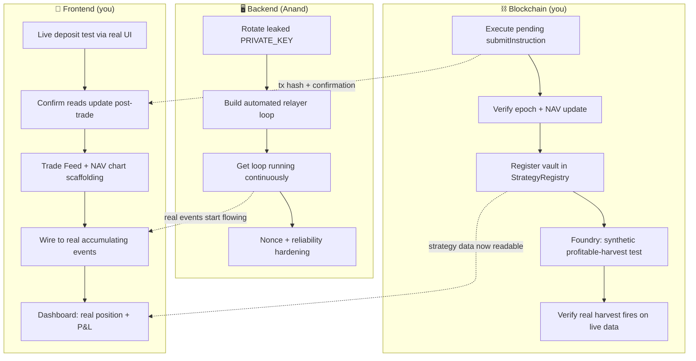

# 🌑 Eclipse Protocol — Week 2 Sprint Plan

**Sprint window:** Jul 14 – Jul 20
**Sprint goal:** Close out Week 1's loose ends (the pending trade, `StrategyRegistry` registration, a real live deposit test), then convert the single proven manual trade into a **real, recurring automated trading loop** so the vault starts accumulating a genuine on-chain track record — with frontend building the event-driven Live Trade Feed and NAV chart on top of that real data as it arrives.

**Where Week 1 left off:** all 4 contracts deployed/verified, FDC attestation pipeline proven twice end-to-end (including signer rotation), one `TradeInstruction` signed and staged but not yet submitted, frontend fully wired for reads with deposit/redeem built but not live-tested, `StrategyRegistry` not yet aware of the vault.

---

## ⚠️ Decision Needed This Week: Real TEE vs. Documented Mock

Not a day-specific task — a call the team needs to make explicitly, not by default. The entire attestation pipeline so far uses a **self-declared attestation claim**, not a genuine Google Confidential Space JWT (a deliberate scope cut from the GCP billing wall in Week 1). Two honest paths forward:

- **Pursue the real enclave this week** if GCP billing is sorted and there's slack in Backend's schedule (see Day 4) — genuinely strengthens the submission's core claim.
- **Formally document the mock as the hackathon's scope boundary** and put the real-TEE work on the public roadmap instead — lower risk with 3 weeks left, and consistent with how you've already been operating (every scope cut so far has been documented, not hidden).

Either is defensible. What's not defensible is leaving it ambiguous in the submission write-up — decide and write it down by end of week.

---

## Dependency Map

**The one true blocker this week:** Day 1's `submitInstruction()` call has to land before almost anything else makes sense to test — it's the transaction that finally produces real, non-zero data for `PerformanceLedger`, which both Blockchain's fee-mechanism verification and Frontend's event-driven components depend on. Protect Day 1 morning for it.

---

## Blockchain Track (you)

**Day 1**
- [ ] **Write:** `AlphaVault.submitInstruction(instruction, signature)` at `0x1b0cf88974ffBC1Fb1744831db5657331627aEcd` — using backend's staged struct (`asset: 0x7A2eD27554A1F5003AAaedf3A3B5f35Ca44F6EbE, direction: 0, size: 100000000, minAmountOut: 100000000000000000000, nonce: 1, deadline: 1783792977`) and the signature they provided. Capture the tx hash — this is your first genuinely judge-verifiable "real trade" artifact.
- [ ] **Read (verify):** `PerformanceLedger.epochCount()` (expect it to move from 0 → 1) and `getEpochs()` for the new entry; `AlphaVault.totalAssets()`/`totalSupply()` to confirm the swap actually moved value through `MockDexRouter`.
- [ ] **Read (check):** whether the high-water mark moved and any fee shares minted — a single small trade likely won't cross the 20% hurdle, and that's fine/expected; just confirm the *logic* didn't silently misfire either way.
- [ ] **Write:** `StrategyRegistry.registerStrategy(vault, name, strategist, bondAmount)` — confirm which address is authorized to call this (check `Ownable`/access-control before spending a transaction on the wrong caller), approve the bond token first if the contract pulls via `transferFrom`.
- [ ] **Read (verify):** `StrategyRegistry.getStrategyByVault(vault)` now returns real data instead of reverting `VaultNotRegistered`.

**Day 2**
- [ ] Confirm the exact EIP-712 domain + `TRADE_INSTRUCTION_TYPEHASH` parameters are correctly copy-pasted into Backend's new automated signing script (same values Week 1 verified against `hashTradeInstruction()` — don't let this drift between the manual test and the automated version).
- [ ] **Foundry:** add a test that deliberately engineers a profitable scenario (adjust `MockDexRouter`'s configured rate mid-test) to force price-per-share above the high-water mark, and assert `_harvest()` correctly mints the 3%/7% split shares. This proves the fee mechanism works *before* relying on a real trade happening to be profitable.

**Day 3**
- [ ] Once Backend's loop has landed a couple of real automated trades: **read** `AlphaVault`'s price-per-share and high-water mark against real data, and if a new high was set, **verify** the fee-mint actually happened correctly on real chain state (not just in the synthetic Foundry test).
- [ ] Reentrancy/checks-effects-interactions self-review on `submitInstruction()`/`harvest()`, now that they've been exercised repeatedly by a live loop instead of a single call.

**Day 4**
- [ ] `forge coverage` — confirm nothing regressed.
- [ ] Re-verify on Blockscout if anything changed (should be a no-op checklist item if no redeploys happened).

**Day 5**
- [ ] Update `DEPLOYMENT.md` with the `submitInstruction()` tx hash, `StrategyRegistry` registration tx hash, and the automated loop's accumulated trade hashes from Backend.
- [ ] Contribute to the team's TEE decision write-up (see Decision box).

---

## Backend Track (Anand)

**Day 1**
- [ ] Cross-check the landed `submitInstruction()` tx against relayer/enclave logs — sanity-check the emitted event data matches what an automated loop would produce.
- [ ] **Security:** rotate the `PRIVATE_KEY` that leaked into the frontend `.env` — generate a fresh key, fund it, confirm the old one is scrubbed from git history entirely (not just `.gitignore`'d going forward — check `git log -p` for prior commits).

**Day 2**
- [ ] Convert the one-off signing script into a **scheduled automated relayer service**: reads live FTSOv2 price → runs a simple, explainable real strategy rule (momentum or mean-reversion, keep it simple) → constructs + signs a new `TradeInstruction` with the registered signer key → calls `AlphaVault.submitInstruction()` automatically. This is the single most important Week 2 deliverable — it's what turns "one trade happened once" into "a real track record."
- [ ] Nonce management: make sure each automated run increments the nonce correctly — a reused/skipped nonce is exactly the kind of bug that silently breaks a loop overnight without an obvious error.

**Day 3**
- [ ] Get the loop running **continuously** on Coston2 — every day it runs from here is a day of genuine, judge-verifiable history you can't manufacture retroactively later.
- [ ] Basic logging/healthcheck so a crash doesn't go unnoticed for days (even a simple log file + a daily manual glance is enough for this stage).

**Day 4**
- [ ] If the team decided to pursue the real Confidential Space enclave this week: attempt it now, in the slack created by the loop already running. If not: spend this day hardening the loop instead — retry logic for RPC hiccups, handling a Coston2 RPC being briefly unavailable without the whole loop dying.

**Day 5**
- [ ] Contribute tx hashes and logs to `DEPLOYMENT.md`.
- [ ] Contribute to the team's TEE decision write-up with the real, current technical status.

---

## Frontend Track (you)

**Day 1**
- [ ] Complete the one item left over from Week 1: **live deposit test through the actual UI** (not `cast`) — connect a funded test wallet, run a real small deposit via `LiveDepositPanel`, confirm the resulting share balance is read back from the contract correctly. Screenshot/record it — this is a demo-ready artifact.
- [ ] After Blockchain's `submitInstruction()` lands: refresh the Vault Detail page and confirm the live TVL/epoch-count numbers actually update — first real visual proof that your reads track real trades, not just static deployment-time state.

**Day 2**
- [ ] Decide the Live Trade Feed / NAV chart data-sourcing approach. **Default recommendation: read events directly from the frontend via `viem`'s `getLogs`/`watchContractEvent`, no new backend service** — at this data volume (one vault, a handful of trades) a separate indexer would be added infrastructure for a problem you don't have yet. Only revisit this if public RPC rate limits actually become a real problem.
- [ ] Confirm the exact event names/params for trade execution and epoch commits with Blockchain (don't guess at ABI event signatures), then scaffold the Live Trade Feed and NAV chart components against them.

**Day 3**
- [ ] Wire the Live Trade Feed to the now-accumulating real events from Backend's loop.
- [ ] Wire the NAV history chart (recharts) from `PerformanceLedger.getEpochs()` — now returning real multi-entry data instead of the Week 1 empty state.

**Day 4**
- [ ] Investor Dashboard: wire real position data (deposited amount, current value, P&L) for the connected wallet, using Day 1's real deposit as the first real data point.
- [ ] Strategist Dashboard: wire real vault stats — TVL, bond amount (now populated post-`StrategyRegistry` registration), enclave status via `EnclaveRegistry.signerOf(vault)`.

**Day 5**
- [ ] Full run-through: connect wallet → real live stats → real trade feed + NAV chart with several real epochs → a second live deposit/withdrawal on camera.
- [ ] Polish empty/loading states for anything still genuinely empty (e.g. if the TEE decision landed on "documented mock," make sure nothing in the UI implies real hardware attestation that isn't there).

---

## End-of-Week Sync (Friday)

- [ ] Real `submitInstruction()`, `StrategyRegistry` registration, and live UI deposit all confirmed and documented with tx hashes
- [ ] Automated trading loop has been running continuously for at least 2–3 days by this point, not started for the first time on Friday
- [ ] At least one real (or Foundry-proven-as-fallback) demonstration of the `harvest()` fee mechanism, ready to explain honestly either way
- [ ] Frontend shows real trade feed and NAV chart data — zero remaining "coming soon" placeholders for data that now genuinely exists on-chain
- [ ] Team has written down, explicitly, the current real state of the TEE (mock vs. genuine) for submission consistency

## Risk Watch

- **The automated loop is the sprint's real risk, not the contracts.** Everything contract-side is already proven reliable from Week 1 — the new failure surface this week is a long-running off-chain process (nonce drift, RPC flakiness, a VM restart wiping the ephemeral key as flagged in your own integration doc). Don't treat "the loop started once successfully" as done; the goal is continuous, multi-day operation.
- **Don't let the TEE decision drift by default into "we'll deal with it later."** If it's still undecided by Wednesday, that's worth a 10-minute team call rather than letting Friday's write-up be the first time it's actually discussed.

---

*Week 3 picks up from here — continued live trading runtime, security hardening pass, and (per the original 4-week plan) starting to prepare demo materials early rather than compressing them all into Week 4.*
